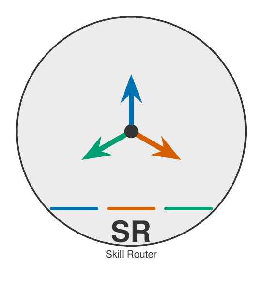
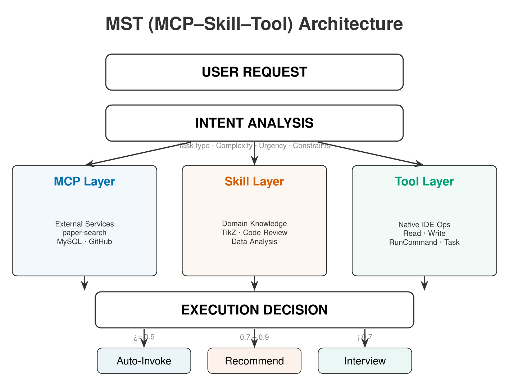
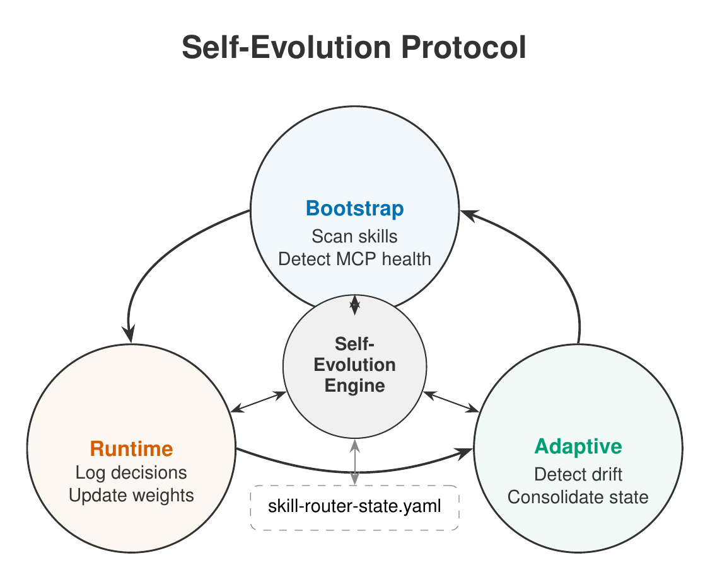

<p align="center">
  
</p>

# Skill Router v3

[](LICENSE)

> 一个 MCP-Skill-Tool 三层路由引擎。你告诉 AI 你想做什么，它自己决定用什么工具。

## 起因

用 Trae / Claude Code / Cursor 的时候，装了几十个 Skill 和 MCP，但每次都要自己想"这个任务该用哪个"。有时候忘了某个 Skill 的名字，有时候不确定该调 paper-search 还是 semantic-scholar。

所以做了这个东西——一个统一的入口，AI 根据你的意图自动选路。

## 它怎么工作

```
你说: "画个 Transformer 架构图放论文里"
  ↓
分析意图 → 科研插图 + LaTeX/TikZ (置信度 0.95)
  ↓
自动调用 tikz-diagrams-guide + figura
  ↓
生成 .tex → 编译 PDF → 出图
```

不需要记每个 Skill 的名字，也不需要手动选择。

## 架构

<p align="center">
  
</p>

三层结构：

| 层 | 干什么的 | 例子 |
|---|---------|------|
| **MCP** | 接外部服务 | 论文搜索、MySQL、GitHub |
| **Skill** | 领域知识 | TikZ 绘图、代码审查、数据分析 |
| **Tool** | IDE 原生操作 | 读写文件、跑命令 |

三层汇聚到同一个决策点，根据置信度分三种走法：

- **置信度 ≥ 0.9** — 直接干，不废话
- **0.7 ~ 0.9** — 给个建议，让你确认一下
- **< 0.7** — 先问清楚你要什么

## 自进化

<p align="center">
  
</p>

不是写死的规则表。它会：

1. **启动时扫描**你装了哪些 Skill、哪些 MCP 还活着
2. **运行中记录**每次路由的结果，调整权重
3. **失败时学习**备用路径

状态存在 `skill-router-state.yaml` 里，下次启动接着学。

## 安装

### Trae（推荐）

```bash
curl -sSL https://raw.githubusercontent.com/Eastr5/skill-router-v3/main/install.sh | bash
```

### Claude Code

```bash
mkdir -p ~/.claude/skills/skill-router
curl -sSL https://raw.githubusercontent.com/Eastr5/skill-router-v3/main/skills/skill-router/SKILL.md \
  -o ~/.claude/skills/skill-router/SKILL.md
```

### Cursor / VSCode

把 `skills/skill-router/SKILL.md` 复制到对应的 skills 目录即可。详见 [跨平台迁移指南](docs/platform-guide.md)。

## 和其他方案的区别

| | [lingxling/awesome-skills-cn](https://github.com/lingxling/awesome-skills-cn) | [TerminalSkills/skills](https://github.com/TerminalSkills/skills) | 本项目 |
|---|---|---|---|
| MCP 感知 | 没有 | 没有 | 有健康检查和自动 fallback |
| 自动决策 | 每次都问你 | 手动配规则 | 置信度阈值自动判断 |
| 跨平台 | Antigravity 专用 | Claude Code 专用 | Trae / Claude / Cursor / VSCode |
| 会越用越准 | 不会 | 不会 | 有自进化机制 |

## 预设了这些组合

| 场景 | 用到的组件 |
|------|-----------|
| 找论文 + 读 + 整理 | `paper-search` + `literature-search` + `Read` |
| 画科研图 + 编译 | `tikz-diagrams-guide` + `figura` + `RunCommand(pdflatex)` |
| Excel 数据出报告 | `MySQL`(可选) + `data-analysis` + `Read` |
| Figma 设计稿转代码 | `figma` + `frontend-design` + `shadcn` + `Write` |
| 代码审查 + 安全扫描 | `TRAE-code-review` + `TRAE-security-review` + `Read` |
| 网页内容转笔记 | `defuddle` + `obsidian-markdown` + `WebFetch` |
| 系统综述 (PRISMA) | `paper-search` + `academic-research-assistant` + `Task` |
| Web 应用测试 | `dogfood` + `agent-browser` + `RunCommand` |
| 搭落地页 | `web-dev` + `frontend-design` + `theme-factory` |
| 视频分镜分析 | `hook-analyzer` + `report-generator` + `Read` |
| 论文从零到发表 | 全套 MCP + Skill + Tool 链路 |

## 两个版本

| 版本 | 大小 | 适合谁 |
|------|------|--------|
| **v3** (~15KB) | 完整 MST 三层 + 自进化 | 需要 MCP 管理、复杂任务编排 |
| **lite** (~5KB) | 纯决策树，无 MCP | 只想要"帮我选 skill" |

```bash
# 默认装两个
curl -sSL .../install.sh | bash

# 只要 v3
curl -sSL .../install.sh | bash -s -- --package v3

# 只要 lite
curl -sSL .../install.sh | bash -s -- --package lite
```

## 项目结构

```
skill-router-v3/
├── skills/
│   ├── skill-router/          # 主路由引擎 (v3)
│   ├── figura/                # 出版级图表
│   └── tikz-diagrams-guide/   # TikZ 科研绘图
├── packages/
│   └── skill-router-lite/     # 轻量版 (v2)
├── templates/
│   └── skill-router-state.yaml
├── install.sh                 # 安装脚本
├── assets/diagrams/           # 架构图 (LaTeX/TikZ 源文件)
└── docs/                      # 详细文档
```

## 贡献

欢迎 PR。比较需要的：

- 新的 Skill 路由规则
- 更多平台的适配验证
- 实际使用中的踩坑记录

## License

MIT
